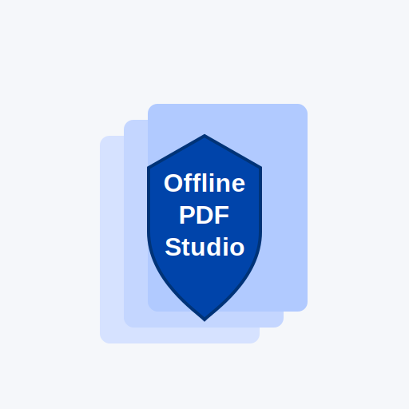
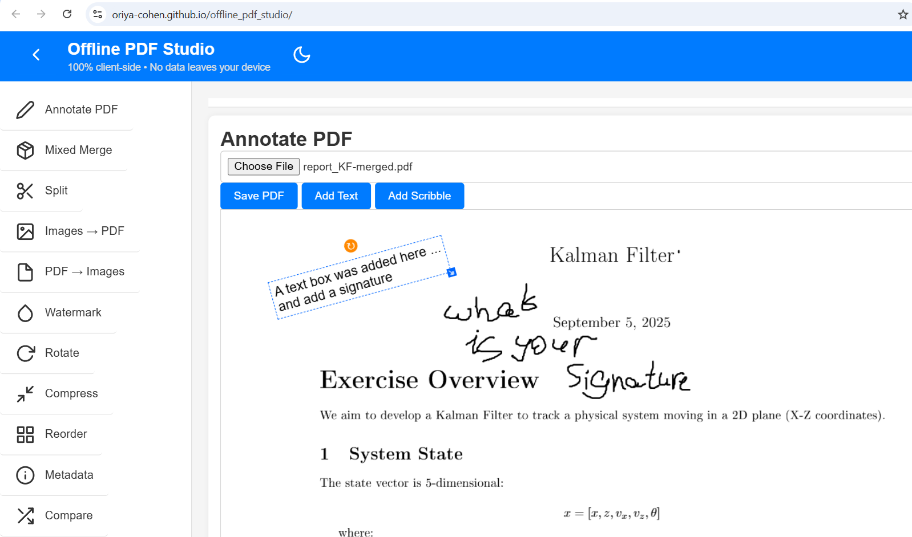

<p align="center">
  
</p>

<h1 align="center">Offline PDF Studio</h1>
<p align="center"><strong>Professional PDF Toolkit — 100% Client-Side. No uploads. No tracking. No servers.</strong></p>

<!-- SCREENSHOT -->
<p align="center">
  
  <br>
  <em>All features run entirely on your device — no cloud, ever.</em>
</p>

<p align="center">
  
  
  
  
</p>

---

## 🛡️ Why Offline PDF Studio?

**Because your documents don’t belong on someone else’s server.**

Offline PDF Studio gives you a full suite of PDF tools entirely inside your browser using pure HTML/CSS/JavaScript.  
Your PDFs never leave your computer, and the app works even with your **Wi-Fi turned off**.

Perfect for:

- confidential documents  
- legal & financial papers  
- corporate workflows  
- personal or private PDFs  
- air-gapped machines  

---

## ✨ Features

### ✏️ PDF Annotation (NEW)
- **Add text annotations** with rotation and scaling
- **Free-hand drawing/scribble** tool
- **Drag, rotate, and resize** annotations
- **Undo/Redo** support (Ctrl+Z / Ctrl+Y)
- **Multi-page support** - annotate any page
- **Works on rotated PDFs** - annotations stay in correct position
- **Export to PDF** - annotations embedded permanently

### 🧩 PDF Editing Tools
- **Merge PDFs**
- **Mixed Merge (PDFs + images together)**
- **Split PDFs** (ranges supported: `1-3, 5, 7-10`)
- **Reorder pages visually** (drag & drop thumbnails)
- **Rotate pages** (single pages or ranges)
- **Compress PDFs**  
  - Lossless  
  - Lossy (quality slider)
- **Add watermarks**
- **Images → PDF**
- **PDF → Images** (PNG, JPEG, WEBP)

---

## 📝 Metadata Tools
View and edit:

- Title  
- Author  
- Subject  
- Keywords  
- Creator  
- Producer  
- Creation Date  
- Modification Date  

Stored locally using `pdf-lib`.

---

## 🔍 Visual PDF Comparison
Side-by-side comparison including:

- rendered thumbnails  
- page size differences  
- missing/extra pages  
- visual mismatch highlight  
- summary of difference count  

Ideal for reviewing print proofs, legal amendments, or version changes.

---

## 🔒 Privacy & Security

✔ **100% client-side**  
✔ **No uploads**  
✔ **No analytics**  
✔ **No cookies**  
✔ **No servers**  
✔ **Open-source**  
✔ **Offline-ready**

---

## 🚀 Running Locally

Just download the project and open `index.html`:

```bash
git clone https://github.com/oriya-cohen/offline-pdf-studio
cd offline-pdf-studio
python -m http.server 8000

# Then open: 
# http://localhost:8000/
```

---

## 🎯 Quick Start - Annotation Tool

1. **Load PDF**: Click the file input to select your PDF
2. **Add Text**: 
   - Click "Add Text" button
   - Double-click on PDF where you want text
   - Type your text
   - Drag orange circle to rotate
   - Drag blue square to scale
   - Drag text box to move
3. **Draw/Scribble**:
   - Click "Add Scribble" button
   - Click and drag on PDF to draw
   - Release to finish
4. **Save**: Click "Save PDF" to download annotated PDF

**Keyboard Shortcuts:**
- `Ctrl+Z` - Undo
- `Ctrl+Y` - Redo
- `Delete` - Delete selected annotation

---

## 📚 Documentation

For detailed annotation system documentation, see:
- [Architecture Guide](js/tools/annotate/ARCHITECTURE.md)
- [Quick Start Guide](js/tools/annotate/QUICKSTART.md)
- [Change Log](js/tools/annotate/CHANGES.md)
